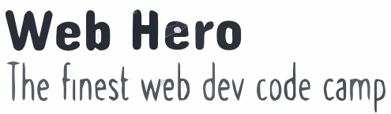

  
   
  <h3><b>Porag's Web Hero 23</b></h3>
  <h5>Fullstack web development course page<h5>
  <h6>Microverse Capstone Project 01 : HTML &amp; CSS, JS</h6>

# 📗 Table of Contents

- [📖 About the Project](#about-project)
  - [🛠 Built With](#built-with)
    - [Tech Stack](#tech-stack)
    - [Key Features](#key-features)
  - [🚀 Live Demo](#live-demo)
- [💻 Getting Started](#getting-started)
  - [Setup](#setup)
  - [Prerequisites](#prerequisites)
  - [Install](#install)
  - [Usage](#usage)
  - [Run tests](#run-tests)
  - [Deployment](#triangular_flag_on_post-deployment)
- [👥 Authors](#authors)
- [🔭 Future Features](#future-features)
- [🤝 Contributing](#contributing)
- [⭐️ Show your support](#support)
- [🙏 Acknowledgements](#acknowledgements)
- [❓ FAQ (OPTIONAL)](#faq)
- [📝 License](#license)

<!-- PROJECT DESCRIPTION -->

# 📖 [Web Hero Developer Code Camp] 

> This project **["Web Hero Fullstack Web Development Course Page"]** is a CAPSTONE project demonstrates the use of indepth HTML, CSS & JS development skills including all the dev. best practices. 
The project includes a Home Page and an About page build for two different screen sizes.
 - Mobile: up to 768px wide.
 - Desktop: 768px or wider.

Links :
 - The home page to about page.
 - The logo in the header links to the home page.

Mobile menu:
 - When the user clicks (or taps) the hamburger button on the header, the mobile menu appears over the page provides proper navigation to different parts of the same or different page.
 - The mobile menu incudes a close (X) button that closes the menu.

Dynamic page:
 - The section "Featured mentors" is created dynamically in JavaScript.
 - A JavaScript variable with the data about the mentors is used to create the HTML for this section dynamically on the page loads.

 Project Live Demo: 
 https://porag-m06.github.io/Porag-s-Web-Hero-23/index.html

 Please navigate to the presentation of this project here: 
 https://www.loom.com/share/94b9fb59f43643249c59440a20f0e6f4

## 🛠 Built With 

### Tech Stack 

  
Client

  <ul>
    <li>HTML</li>
    <li>CSS</li>
    <li>JS</li>
  </ul>

  
Server

  <ul>
    <li>Deployed Using GitHub Pages</li>
  </ul>

Database

  <ul>
    <li>N/A</li>
  </ul>

<!-- Features -->

### Key Features 

> Describe between 1-3 key features of the application.

- **[Conversion of a Design (e.g. Figma) to HTML/CSS]**
- **[Responsive Web Design: Desktop & Mobile]**
- **[Interactivity Using JS]**

(<a href="#readme-top">back to top</a>)

<!-- LIVE DEMO -->

## 🚀 Live Demo 

> Please follow the link for a live demo.

- [Web Hero Code Camp](https://porag-m06.github.io/Porag-s-Web-Hero-23/index.html)

(<a href="#readme-top">back to top</a>)

<!-- GETTING STARTED -->

## 💻 Getting Started 

To get a local copy up and running, follow these steps.

### Prerequisites

In order to run this project you need:
- Git.
- An IDE (e.g. VS Code)
- Browser to run. 

### Setup

Clone this repository to your desired folder:
 - Using Git Bash or any integrated terminal of you choice.
 - Open with code editor (e.g. VS Code).
 - Open the index.html file using any local server (e.g. live server extension in VS Code)

### Usage

To run the project, execute the following command:
- Open the index.html file on a local server on your browser. 

### Deployment

You can deploy this project using:
- GitHub Pages for the main branch. A deployed version can be found here:
https://porag-m06.github.io/Porag-s-Web-Hero-23/index.html

(<a href="#readme-top">back to top</a>)

<!-- AUTHORS -->

## 👥 Author 

> Developed by: 

- GitHub: [@porag-m06](https://github.com/porag-m06)
- Twitter: [@twitterhandle](https://twitter.com/twitterhandle)
- LinkedIn: [LinkedIn](https://www.linkedin.com/in/muhammad-porag-nsu-cse/)

(<a href="#readme-top">back to top</a>)

## 🤝 Contributing 

Contributions, issues, and feature requests are welcome!

Feel free to check the [issues page](https://github.com/porag-m06/Porag-s-Web-Hero-23/issues).

(<a href="#readme-top">back to top</a>)

<!-- ACKNOWLEDGEMENTS -->

## 🙏 Acknowledgments 

I would like to thank  [Cindy Shin](https://www.behance.net/adagio07) the author of the [original design](https://www.behance.net/gallery/29845175/CC-Global-Summit-2015), for the design used in this project.

(<a href="#readme-top">back to top</a>)

## 📝 License 

This project is [MIT](./LICENSE) licensed.

(<a href="#readme-top">back to top</a>)

